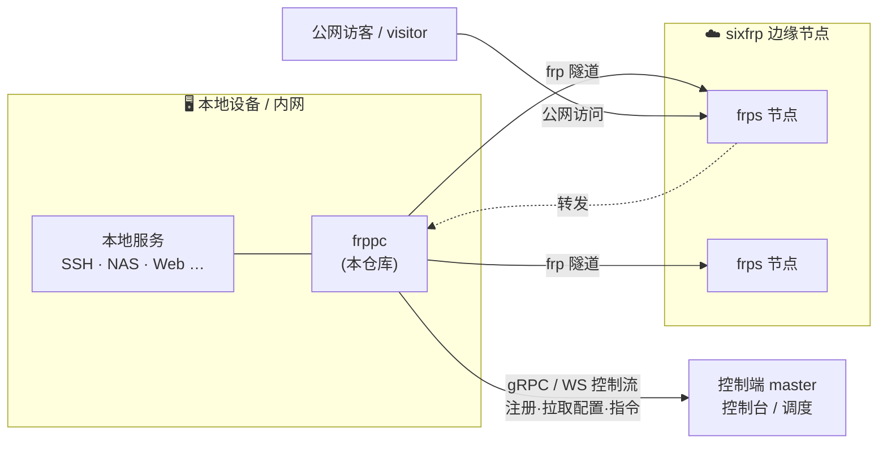

# sixfrp

> 更高速、更稳定的**内网穿透**与端口映射服务 — 基于 [frp](https://github.com/fatedier/frp) 全协议打造，无需公网 IP。

[](https://go.dev/)
[](https://github.com/fatedier/frp)
[](#从源码构建)
[](./LICENSE)

[sixfrp.com](https://sixfrp.com/) 是一个托管式内网穿透平台：在国内稳定、全球优化的高防 BGP 节点网络上，几分钟内就能把本地服务发布到公网。平台就近选择优质节点，通过统一控制台集中管理你的所有隧道，并**完整支持原版 frp 全协议**。

本仓库是 sixfrp 平台的**客户端代理 `frppc`**（frp Panel Client）。它常驻在你的设备上，向平台控制端（master）注册后，自动拉取隧道配置、拉起 frp 连接，并响应控制台下发的运维指令（远程终端、日志、升级等）。

---

## 目录

- [核心特性](#核心特性)
- [支持的协议](#支持的协议)
- [整体架构](#整体架构)
- [快速开始](#快速开始)
- [配置](#配置)
- [master ⇄ frppc 指令](#master--frppc-指令)
- [从源码构建](#从源码构建)
- [项目结构](#项目结构)
- [典型使用场景](#典型使用场景)
- [许可证](#许可证)

---

## 核心特性

- **无需公网 IP** — 由平台的高防 BGP 节点承载入口流量，本地服务通过 frp 反向连接对外发布。
- **原版 frp 全协议支持** — 直接复用 `fatedier/frp` 客户端内核，隧道能力与原版一致。
- **控制台集中管理** — 隧道的创建 / 更新 / 删除全部由控制端下发，`frppc` 自动同步，无需手改本地配置文件。
- **配置热同步** — 启动时拉取一次，并按固定间隔周期性 re-sync，隧道增删即时生效。
- **远程终端（PTY）** — 控制台可通过加密流直连设备的交互式 Shell，支持窗口 resize；可选 **TOTP 双因子**门禁。
- **实时日志推流** — 按需向控制台推送 frpc 运行日志，问题排查无需登录设备。
- **自升级与远程重启** — 控制端可下发升级 / 重启指令；支持二进制原地替换（re-exec / respawn）或自定义外部升级脚本。
- **稳健的连接** — gRPC 双向流断线自动重连；系统事件（启动 / 停止）经去抖后上报，避免重连风暴。
- **安全接入传输** — 接入 sixfrp 平台统一走 gRPC over WebSocket TLS（`wss`），穿透防火墙与反向代理，全程加密。
- **全平台交叉编译** — Linux / macOS / Windows / FreeBSD / OpenBSD，覆盖 amd64、arm64、armv7、loong64、riscv64、mips 系列等架构。

## 支持的协议

`frppc` 复用原版 frp 内核，覆盖全部代理类型：

| 类别 | 协议 |
| --- | --- |
| 基础端口映射 | **TCP**、**UDP**（支持范围端口批量映射、加密 `useEncryption` / 压缩 `useCompression`） |
| Web | **HTTP**、**HTTPS** |
| 点对点 / 内网直连 | **STCP**、**SUDP**、**XTCP**（visitor 模式） |
| 多路复用 | **TCPMUX** |

隧道配置由控制端统一下发，无效的单条 proxy / visitor 会被跳过，不影响同一客户端上的其它隧道。

## 整体架构



- **master（控制端）** — 平台的控制平面。管理客户端、下发隧道配置与运维指令，聚合系统事件与日志。
- **frppc（本仓库）** — 设备侧代理。通过 gRPC（可经 WebSocket 隧道）连接 master，注册身份后拉取配置、管理本地 frp 客户端实例、执行下发的指令。
- **frps（边缘节点）** — 承载公网入口的 frp 服务端节点，由平台运维。
- **visitor** — 对 STCP/XTCP 等点对点隧道，访问端同样通过 frppc 以 visitor 身份接入。

`frppc` 基于 [Goravel](https://github.com/goravel/framework) 框架构建，运行时由两个后台 runner 驱动：

- `frppc-client-rpc-stream` — 维持与 master 的 gRPC 双向流，注册并消费下发事件，断线自动重连。
- `frppc-periodic-pull` — 周期性拉取最新隧道配置并做增量同步。

## 快速开始

### 1. 获取二进制

从 [Releases](https://cnb.cool/sixkun/sixfrp/-/releases) 下载对应平台的 `frppc`，或[从源码构建](#从源码构建)。

### 2. 运行

在 sixfrp 控制台创建客户端后，你会得到一对 **客户端 ID** 与 **密钥**，以及 master 的 **接入地址**（形如 `wss://<master域名>/grpc-ws`）。三者齐备即可一行命令启动：

```bash
frppc -i <客户端ID> -s <密钥> --rpc-url wss://<master域名>/grpc-ws
```

启动后，frppc 会通过 `wss` 连接 master 并注册，随后自动拉取隧道配置、拉起 frp 连接，并常驻监听控制台下发的指令。无需在本地编写任何 frp 配置文件——隧道的增删改全部在控制台完成，frppc 会自动同步。

参数说明：

| 参数 | 说明 | 必填 |
| --- | --- | --- |
| `-i` | 客户端 ID（平台分配） | ✅ |
| `-s` | 客户端密钥（平台分配） | ✅ |
| `--rpc-url` | master 接入地址，见下方说明 | ✅ |

也可以完全通过环境变量启动（不带任何 flag），详见[配置](#配置)。

**接入地址（`--rpc-url` / `FRPPC_RPC_URL`）：**

sixfrp 平台的 master 仅通过 **gRPC over WebSocket TLS（`wss`）** 对外提供接入，统一走 `443` 端口、路径 `/grpc-ws`，穿透各类防火墙与反向代理最为稳妥：

```
wss://<master域名>/grpc-ws
```

> 其它 scheme（`grpc://` 明文、`ws://` 非 TLS）仅用于本地开发 / 自建 master 的调试，生产接入 sixfrp 平台请统一使用 `wss`。

### 3. Docker

官方多架构镜像（`linux/amd64, arm/v6, arm/v7, arm64`）已发布到两个仓库，任选其一：

```bash
# CNB 制品库
docker pull docker.cnb.cool/sixkun/sixfrp:latest

# GitHub Container Registry
docker pull ghcr.io/sixkun/sixfrp:latest
```

以环境变量注入身份即可运行（将 `:latest` 换成具体版本号如 `2.0.0` 可锁定版本）：

```bash
docker run -d --name frppc --restart unless-stopped \
  -e FRPPC_ID=<客户端ID> \
  -e FRPPC_SECRET=<密钥> \
  -e FRPPC_RPC_URL=wss://<master域名>/grpc-ws \
  docker.cnb.cool/sixkun/sixfrp:latest
```

也可从源码自行构建镜像：

```bash
docker build -f Dockerfile.frppc -t sixfrp/frppc .
```

> Docker 镜像内不支持二进制原地自升级，请通过更新镜像来升级。

### 4. 作为系统服务运行

`frppc` 内置系统服务支持（`kardianos/service`），可注册为 systemd / launchd / Windows 服务常驻后台。将 `FRPPC_RESTART_COMMAND` 设为对应的服务重启命令（如 `systemctl restart haokun-frppc`），即可让控制台的“远程重启”指令生效。

## 配置

`frppc` 的配置遵循 Goravel 约定，读取自环境变量或项目根目录 / `cmd/frppc/` 下的 `.env` 文件（参考 [`cmd/frppc/.env.example`](./cmd/frppc/.env.example)）。命令行 `-i` / `-s` / `--rpc-url` 会覆盖对应的环境变量。

### 核心身份与连接

| 变量 | 默认值 | 说明 |
| --- | --- | --- |
| `FRPPC_ENABLED` | `true` | 是否在启动时连接 master。设为 `false` 可让二进制保持静默（便于本地调试）。 |
| `FRPPC_ID` | — | 平台分配的客户端 ID，与密钥一起用于每次 RPC 鉴权。 |
| `FRPPC_SECRET` | — | 平台分配的客户端密钥。 |
| `FRPPC_RPC_URL` | `grpc://127.0.0.1:9001` | master 接入地址。接入 sixfrp 平台请使用 `wss://<master域名>/grpc-ws`；默认值仅用于本地开发。 |
| `FRPPC_SYNC_INTERVAL_SECONDS` | `30` | 周期性重新同步隧道配置的间隔（秒）；启动时会额外拉取一次。 |

### 远程功能开关

| 变量 | 默认值 | 说明 |
| --- | --- | --- |
| `FRPPC_FEATURES_ENABLE_REMOTE_SHELL` | `true` | 是否允许控制台发起远程终端（PTY）连接。设为 `false` 则拒绝所有 PTY 请求。 |
| `FRPPC_FEATURES_TOTP_SECRET` | — | 设置后，远程终端需 TOTP 校验：首次连接返回 `otpauth://` 绑定链接，之后每次连接都需输入动态验证码。留空则不启用门禁。 |

### 升级与重启

| 变量 | 默认值 | 说明 |
| --- | --- | --- |
| `FRPPC_UPGRADE_COMMAND` | — | 外部升级命令（对应“脚本升级”类型），`frppc` 以分离进程执行，并将 `{{url}}` 替换为解析后的下载地址。 |
| `FRPPC_RESTART_COMMAND` | — | 远程重启指令要执行的命令，由该命令负责重启 `frppc` 服务。 |

### 应用与日志

| 变量 | 默认值 | 说明 |
| --- | --- | --- |
| `FRPPC_APP_NAME` | `Goravel` | 应用名。 |
| `FRPPC_APP_ENV` | `production` | 运行环境。 |
| `FRPPC_APP_DEBUG` | `false` | 调试模式。 |
| `LOG_CHANNEL` | `stack` | 日志通道。 |
| `LOG_LEVEL` | `debug` | 日志级别。 |

## master ⇄ frppc 指令

注册成功后，`frppc` 在 gRPC 双向流上消费控制端下发的事件并回执结果：

| 事件 | 作用 |
| --- | --- |
| `UPDATE_FRPC` / `REMOVE_FRPC` | 新增 / 更新 / 移除隧道配置 |
| `START_FRPC` / `STOP_FRPC` | 启停某个 frp 客户端实例 |
| `GET_PROXY_INFO` | 查询代理运行状态 |
| `START_STREAM_LOG` / `STOP_STREAM_LOG` | 开始 / 停止实时日志推流 |
| `START_PTY_CONNECT` | 建立远程终端会话 |
| `PTY_TOTP_BIND` / `PTY_TOTP_VERIFY` | 远程终端的 TOTP 绑定 / 校验 |
| `UPGRADE_AGENT` | 自升级（原地替换或外部脚本） |
| `RESTART_AGENT` | 远程重启 |
| `PING` / `PONG` | 心跳，并上报客户端版本 |

RPC 契约由 [`cnb.cool/sixkun/sixfrp-client-proto`](https://cnb.cool/sixkun/sixfrp-client-proto) 定义。

## 从源码构建

### 前置条件

- [Go 1.26+](https://go.dev/)（构建启用 `GOEXPERIMENT=jsonv2`）
- [Bun](https://bun.sh/)（多平台构建脚本使用）
- 访问 `cnb.cool` 私有 Go 模块的凭据（`goravel` 与 `frp` 的定制分支）

### 单平台快速构建

```bash
GOEXPERIMENT=jsonv2 go build -o frppc ./cmd/frppc
```

### 多平台发布构建

构建脚本会为全部目标平台交叉编译并打包：

```bash
# 构建全部默认平台
bun run scripts/build-target.ts frppc

# 或指定平台子集
PLATFORMS="darwin/arm64,linux/amd64,linux/arm64,windows/amd64" \
  VERSION=$(git describe --tags --always --dirty) \
  bun run scripts/build-target.ts frppc
```

产物输出到 `build/frppc/`。默认覆盖的平台包括 Darwin（amd64/arm64）、Linux（amd64/arm64/arm/armv7/loong64/riscv64/mips 系列）、FreeBSD、OpenBSD、Windows（amd64/arm64）。

CI 由 [CNB](https://cnb.cool/) 流水线驱动（见 `.cnb/`）：推送 `main` 产出 nightly 预发布，打 `v*` tag 产出正式 Release。

## 项目结构

```
sixfrp/
├── cmd/frppc/              # frppc 客户端代理（可执行入口）
│   ├── main.go             #   解析 -i/-s/--rpc-url，注入环境后引导 Goravel
│   ├── bootstrap/          #   应用引导：providers / commands / config
│   ├── config/             #   frppc.* 配置定义
│   ├── frpcclient/         #   核心：master 客户端、RPC 事件处理、隧道控制器、PTY、TOTP
│   ├── runners/            #   后台 runner：RPC 长连接、周期同步
│   ├── contracts/          #   Service 契约接口
│   └── streamlog/          #   日志推流 sink
├── haokun/                 # 共享内部包
│   ├── version/            #   版本信息（构建期注入）
│   ├── defs/               #   系统事件等定义
│   └── grpc/support/wsgrpc/#   gRPC over WebSocket 传输适配
├── utils/                  # 通用工具：frp 配置转换、自升级、系统事件去抖、端口解析等
├── scripts/                # Bun/TS 多平台构建与发布脚本
├── Dockerfile.frppc        # frppc 客户端镜像
└── codegen.sh              # protobuf 代码生成
```

## 典型使用场景

- **个人设备远程访问** — NAS、家庭服务器、远程桌面。
- **开发调试与演示** — 将本地开发环境临时暴露到公网做联调 / 演示。
- **网站与回调调试** — Webhook、支付回调、机器人事件等外部回调的本地接收。
- **团队 / 企业内网接入** — 后台系统、测试平台、内部工具的统一对外访问入口。

## 许可证

本项目为**专有软件（Proprietary）**，版权归 sixkun 所有，保留所有权利。未经书面许可，不得复制、修改、分发或用于其它用途。详见 [LICENSE](./LICENSE)。

---

<p align="center">
  <sub>Built on <a href="https://github.com/fatedier/frp">frp</a> · Powered by <a href="https://github.com/goravel/framework">Goravel</a> · 官网 <a href="https://sixfrp.com/">sixfrp.com</a></sub>
</p>
